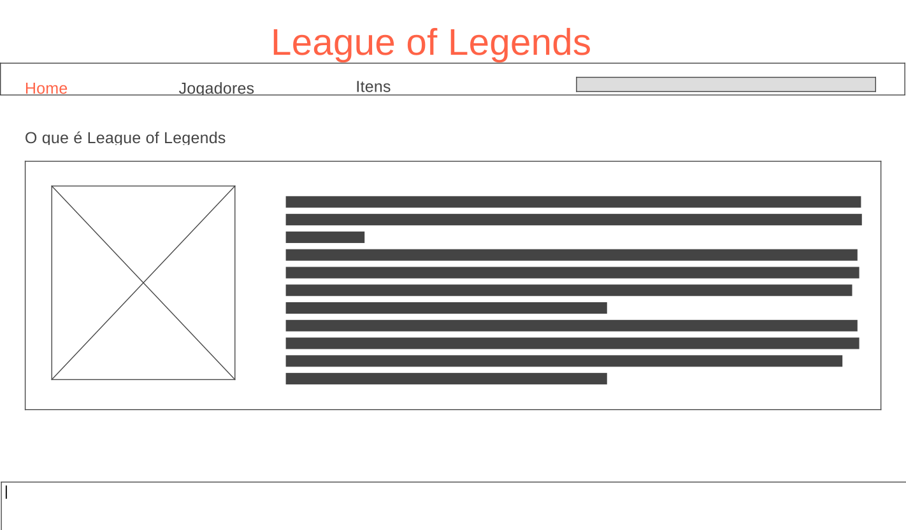
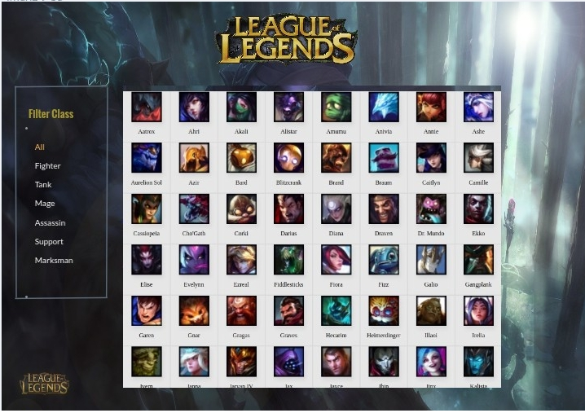

# Data Lovers - League of Legends

## Resumo do projeto

Neste projeto foi desenvolvido uma _página web_ para visualizar um
_conjunto (set) de dados_** que se adeque ao que o usuário necessite.

A página web permite ao usuário visualizar os dados dos personagens com uma breve descrição e também informando sobre a quantidade de ataques, defesa, magia e dificuldade.

Permite fazer uma busca através do filtro pelas tags: Fighter, Tank, Mage, Assassin, Support, Marksman. Ordena e compara até cindo personagens em Attack, HP, MP, Armor, Magic Resist, mostrado o resultado em um gráfico.

* [League of Legends - Challenger leaderboard](src/data/lol/lol.json):
  Este set de dados mostra a lista de jogadores em uma liga do
  jogo League of Legends (LoL).

### Protótipo

* a ideia inicial do projeto era esta:
1. Home:

2.Seleção de Personagem:

* Começando a codar chegamos na seguinte estrutura com um filtro lateral:

Para o protótipo final, mudamos o filtro de lugar, pois ficaria mais claro e eficiente se os filtros ficassem juntos em um mesmo local do site, chegamos no resultado abaixo:
(imagem/prototipo3)

#### Checklist

* [x] Usar VanillaJS.
* [ ] Inclui _Definição de produto_ clara e informativa no `README.md`.
* [x] Inclui esboço da solução (protótipo de baixa fidelidade e de alta fidelidade, se houver) no
  `README.md`.
* [ ] Inclui a lista de problema detectados através dos testes de usabilidade
  no `README.md`.
* [ ] UI: Mostra lista e/ou tabela com dados e/ou indicadores.
* [ ] UI: Permite ordenar os dados por meio de um ou mais campos
  (asc e desc).
* [ ] UI: Permite filtrar os dados com base em uma condição.
